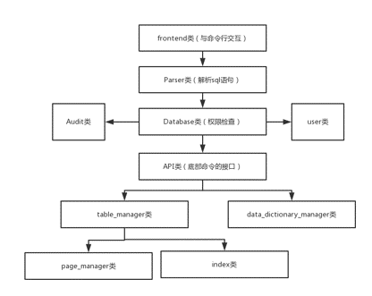


# MiniSql

@(DBMS)[Minisql]

**MINISQL** 是一个基于文件系统的DBMS，它实现了基础的查找，插入，删除和更新等操作，支持不相关子查询，支持group by子句和聚集函数，并且它能够根据查找的select语句实现基本的查询优化，并且对查询等操作有带有索引的物理优化。

- **示例sql** - 见example.txt
- **环境** -windows  

----------

## 模块介绍

> Minisql主要分为三个部分，第一个部分是frontend类，主要负责从命令行中读取sql语句以及展示相应的输出。第二个部分是Parser类，Database类以及API类，主要负责对相关用户权限的检查以及对sql语句解析优化并执行相关的调用。第三个部分是table_manager和data_dictionary_manager类等，主要负责表，数据字典等的信息在文件系统中的存储以及查询，插入等操作的支持。

> 

### frontend类
>frontend类主要负责对于命令行从读取命令

###Parser类
>Parser类负责接收frontend传来的sql语句，然后解析出对应的sql语句的含义，传递给Database类执行相关的调用。

###Database类
>Database类主要负责对Parser类的调用进行权限检查，合法性检查等工作，并对成功的操作执行日志文件的记录。

###API类
>将对底层的操作封装在一个类中，方便上层调用。

###Buffer_manager类
>对于表而言，我们使用page来进行管理，所以需要一个类对页进行管理，执行对应页的调入和换页等操作。

###Table_manager类
>实现对表的基本操作，包括定义删除增删查改等等，同时实现对表中数据的索引等等。

